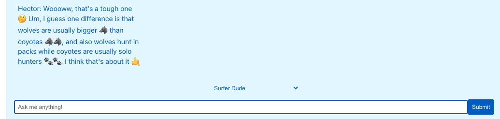
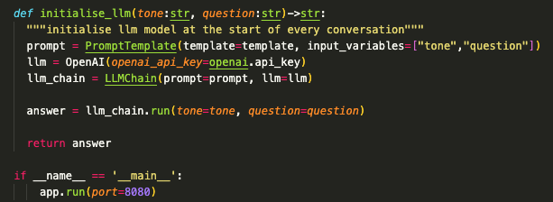

# Hector AI

Gen AI-powered responses with the tone and style of your choice! Be it a surfer, a sarasctic teenager or a butler, Hector can do it all.

## Table of Contents
- [Introduction](#introduction)
- [Features](#features)
- [Technologies Used](#technologies-used)
- [Getting Started](#getting-started)
  - [Prerequisites](#prerequisites)
  - [Installation](#installation)
- [Usage](#usage)

## Introduction

Hector is a versatile AI model that allows users to choose the tone of the responses it generates. Whether you prefer a formal, casual, or humorous tone, this model caters to your communication style. This is more an exhibition of skill and creativity than it is practical. 

## Features

- Generate AI responses with different tones
- Easy-to-use interface for tone selection
- Seamless integration with various applications

## Technologies Used

- Python
- Flask
- React
- Langchain 
- MUI components
- OpenAI GPT-3.5

## Future Features
Hector will be able to take in text as tone. Choose exactly what you want for whatever you need. Dark mode will also be integrated. Chat history and document intake.
- I will also aim to make the UI a bit friendlier with smoother transitions and animations.

### Getting Started

Make sure you have the following installed:

- Python 3.8 or later
- Flask
- Langchain

### Installation

Clone the repository and install dependencies:

git clone https://github.com/tomsoust/Hector-GenAI
cd genai-hector
pip install
